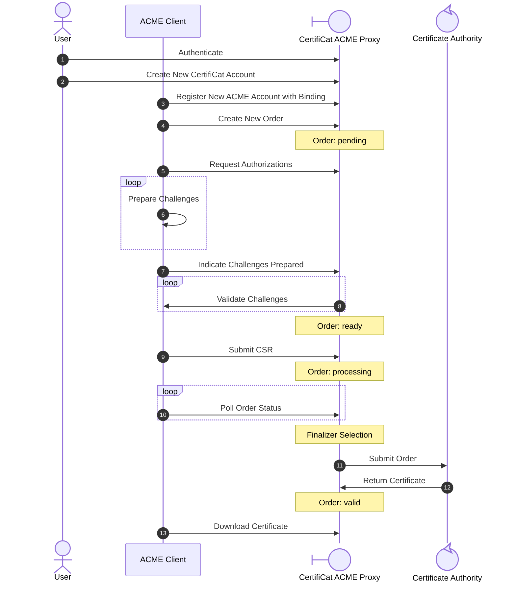

# Features

An ACME order transaction consists of three parties.

- **ACME client**: Creates the CSR and may control reloading services when the certificate is downloaded.
- **CertifiCat**: Answers requests from the ACME client and proxies the CSR to an upstream authority.
- **Certificat Authority**: The service ultimately responsible for processing the CSR and creating a certificate.

The following diagram illustrates the ideal path for an ACME transaction including new account creation. CertifiCat ACME features are grouped and documented by how they extend and support the ACME protocol.



## CertifiCat Authentication

<!-- md:config `certificat.authentication.section` `certificat.authentication` -->

CertifiCat requires authentication, it does not operate as an anonymous ACME proxy. 

### SAML

<!-- md:config `certificat.authentication[saml]` -->

SAML is the preferred and best-supported authentication method. When configuring SAML you need the following data:

- <!-- md:config `certificat.url_root` -->
- PEM-formatted public/private key pair
- IdP XML Metadata
- SAML Attribute Statement

#### Configuration

1. Set <!-- md:config `certificat.authentication.sp.entity_id` --> to your chosen entity ID. A good rule of thumb is to use the domain for CertifiCat and append a path. For example: `https://acme.edu/saml2`.

2. Generate the PEM-formatted key 
    - Set <!-- md:config `certificat.authentication.sp.key_file` --> to the private key location
    - Set <!-- md:config `certificat.authentication.sp.cert_file` --> to the public key location

3. Download the IdP metadata
    - Set <!-- md:config `certificat.authentication.idp.local` -->array to the metadata location 

    ``` yaml title="minimal example"
    certificat:
    authentication:
        type: saml
        sp:
        entity_id: "https://acme.edu/saml2"
        key_file: "/etc/certificat/sp.key"
        cert_file: "/etc/certificat/sp.crt"
        idp:
        local: 
            - "/etc/certificat/idp-metadata.xml"
    ```

4. Configure attribute mapping. [Read the documentation for examples](../configuration/#certificat.authentication[saml].attribute_mapping) of how to map your attributes if mapping is not working.

#### Troubleshooting

Set <!-- md:config `certificat.authentication.debug` --> to `True` to enable debug logs and consult the web logs when a user is attempting to authenticate.

---

### Remote

<!-- md:config `certificat.authentication[remote]` -->

!!! warning

    When using the remote authentication method, it's critical that no clients can connect directly to CertifiCat or directly set the `user_header`. CertifiCat relies on network security and upstream header stripping to ensure the headers it receives are valid.

#### Configuration 

Remote authentication uses headers from a trusted proxy to automatically authenticate a user. Visit the configuration reference for a detailed example of how to configure authentication.

#### Troubleshooting

Set <!-- md:config `certificat.authentication[remote].log_http_headers` `certificat.authentication.log_http_headers` -->to `True` to enable debug logs and consult the web logs when a user is attempting to authenticate.

## External Account Binding

[External account binding (EAB)](https://datatracker.ietf.org/doc/html/rfc8555#section-7.3.4) is required for all CertifiCat ACME accounts. This associates a CertifiCat web account with an ACME account and allows ACME activity to be tracked through the web portal. It also prevents anonymous users from creating ACME accounts without first validating against your IdP.

Every user able to authenticate to CertifiCat is authorized to create a new external ACME account and then bind that account to a local ACME client.

## ACME Challenges

<!-- md:config `acme.challenges_available` -->

All ACME clients are required to answer challenges by default. 

CertifiCat supports a few different [identifier validation challenges](https://datatracker.ietf.org/doc/html/rfc8555#section-8) and strategies.

### HTTP-01

<!-- md:badge `:material-cog-outline:` `"http-01"` -->

This is the preferred challenge method. It requires the CertifiCat server to have "line-of-sight" to the requesting server and also requires port 80 to be open. [In response to overeager systems admins, LetsEncrypt has drafted a best practice on keeping port 80 open.](https://letsencrypt.org/docs/allow-port-80/)

This method is simple and easy to automate consistently.

---

### DNS-01

<!-- md:badge `:material-cog-outline:` `"dns-01"` -->

For some institutions or applications HTTP-01 can be impractical. CertifiCat also supports `DNS-01` challenges. This is more difficult to implement for a few different reasons. 

- The operator must be given correctly-scoped access to modify DNS; an external service
- The operator must build in time and checks to verify DNS has propagated before signaling to CertifiCat to continue

---

### Pre-Authorizations

Administrators may also configure pre-authorized identifiers per account using the account management web interface. Any orders from the configured account with identifiers matching the pre-configured ones will automatically create valid authorizations. This is usually used sparingly with services that have significant roadblocks to `DNS-01` or `HTTP-01` challenges.

## Finalizers

<!-- md:config `certificat.finalizer` -->

Finalizers are modules that are responsible for submitting the client CSR to a certificate authority and returning the generated certificate. CertifiCat is designed to work with one default finalizer but can support using alternative finalizers that are selected based on criteria like account preference.

### Local Finalizer

<!-- md:config `certificat.finalizer[local]` -->

!!! warning

    This is an evaluation/non-prod finalizer. Do not use any of the certificates generated by this finalizer by services.

The `local` finalizer is used for demonstrations and quick-start examples. It only requires a PEM-formatted keypair to get started. Visit the configuration reference for a detailed example of how to configure the finalizer.

---

### ACME Finalizer

<!-- md:config `certificat.finalizer[acme]` -->

The ACME finalizer is a general-purpose fallback that can be used with any upstream that exposes an ACME API. Many certificate authorities pre-authorize identifiers through processes like domain-control validation and therefore don't require answering real-time challenges. By default, this finalizer operates under that assumption.

#### Configuration

The ACME finalizer is straightforward. You need to collect two things before using the finalizer.

**Directory URL**
:  This is a discovery document that lists capabilities and URLs for an ACME server.
:  LetsEncrypt's is `https://acme-v02.api.letsencrypt.org/directory`.

**External Account Binding**
: EAB is a key id and hmac key. You'll need to generate these to bind to a pre-existing account created by the provider.

Plug these keys into the finalizer config as documented at the beginning of this section.

#### Troubleshooting

Refer to the logs in the CertifiCat tasks runner for debugging. Remember to adjust <!-- md:config `certificat.logging` --> and enable `"DEBUG"` logging if the output is not verbose enough.

---

### CERTINext ACME Finalizer

<!-- md:config `certificat.finalizer[certinext-acme]` -->

This is a specialized ACME finalizer that is tailored to CERTInext requirements.

#### Prerequisites

CERTINext requires different profiles depending on the type of certificate requested. Before configuring the finalizer you need to create two ACME intergrations in CERTInext.

1. [Navigate to the ACME API integrations](https://us.certinext.io/acmeApi)
2. Create a new API credential of type `ACME` with the `InCommon OV SSL Certificate` product.
3. Create another new API credential of type `ACME` with the `InCommon OV SSL Certificate UCC` product.

#### Configuration

Reference the <!-- md:config `certificat.finalizer[certinext-acme]` --> section. Use the `InCommon OV SSL Certificate` credential created for the `single_domain_binding` section and the `InCommon OV SSL Certificate UCC` credential for the `multi_domain_binding` section.

#### Troubleshooting

ACME has a mechanism to return descriptive errors on order failure. The order page will echo those errors, and they should help diagnose any problems. If that is not enough, you can refer to the logs in the CertifiCat tasks runner for debugging. Remember to adjust <!-- md:config `certificat.logging` --> and enable `"DEBUG"` logging if the output is not verbose enough.

It is unlikely that you will see more error detail by looking at the logs, in most cases you will have to adjust your API integration or reach out to CERTINext directly to diagnose why your API integration is not working.

---

### Using Multiple Finalizers

<!-- md:config `certificat.alternative_finalizers` -->

Operators may provide a list of alternative finalizers that can be used instead of the default finalizer. Anyone who can edit an account may choose to use one of these alternative finalizers instead of the default one.

If an alternative finalizer is removed or the id changes, all accounts using that finalizer will revert to the default finalizer.