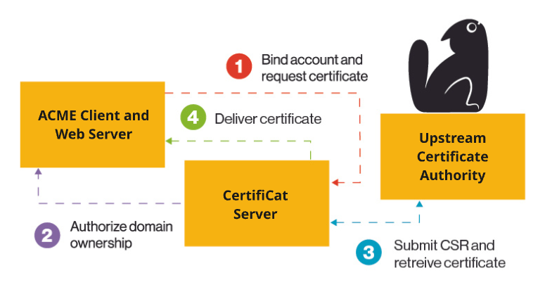

---
hide:
  - navigation
---

# What is CertifiCat?

CertifiCat is an open-source ACME proxy and web interface that manages certificate issuance in one central place. 

It runs on your internal network and provides authenticated clients with a vendor-neutral way to request certificates using the ACME protocol. Clients can use their preferred ACME tools, such as Certbot or Posh-ACME, and prove ownership using HTTP-01, DNS-01, or in special cases pre-authorized identifiers. 

The web interface ensures only authenticated users can create accounts and lets users track the status of their orders and self-service triage and view errors during issuance.

## Why ACME is Important

[ACME](https://datatracker.ietf.org/doc/html/rfc8555) is a standard protocol designed to manage the entire lifecycle of a certificate. Many products such as application servers, load balancers, and even VPNs have built-in support for requesting and gracefully reloading certificates using ACME. 

CertifiCat builds on this by embedding an ACME server in your network and translating vendor-specific quirks to standard ACME and IAM practices. You control who can create accounts and request certificates and CertifiCat takes care of ensuring the clients have proper authorization and communicating to the upstream authority.

!!! note ""

    Becoming an ACME-first organization saves you work. The ACME protocol changes slowly and has widespread adoption. Migrating between ACME servers is as simple as re-binding your account and changing the discovery URL.

## Getting started

[Use Docker Compose to start a local evaluation server.](getting-started/local.md) When you're ready, [transition from there to a production-ready ACME server.](getting-started/production.md)

